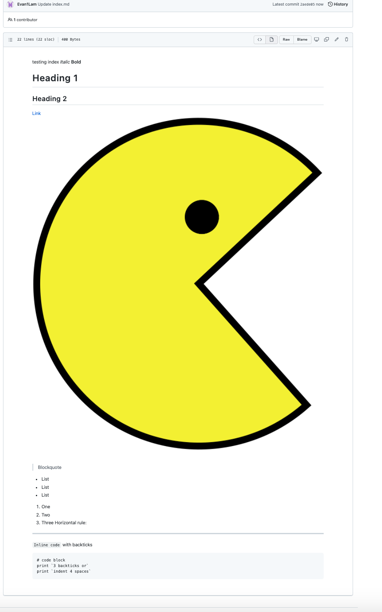
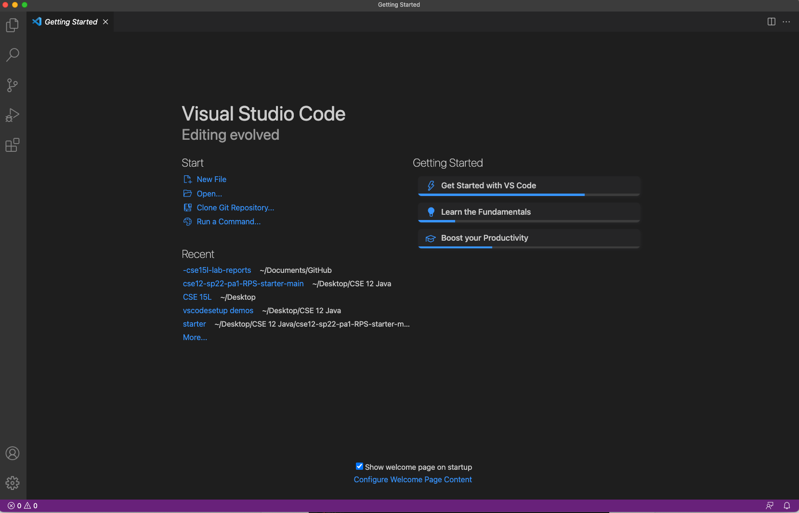
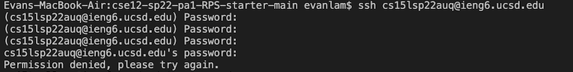
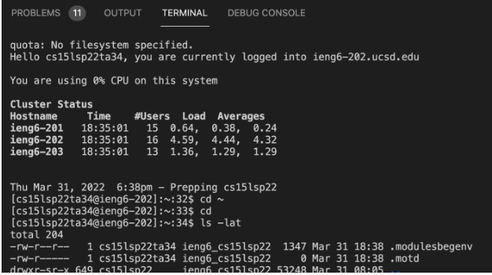
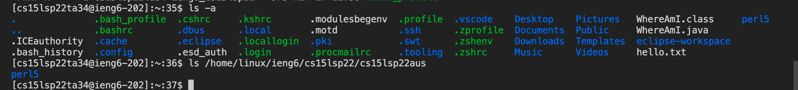
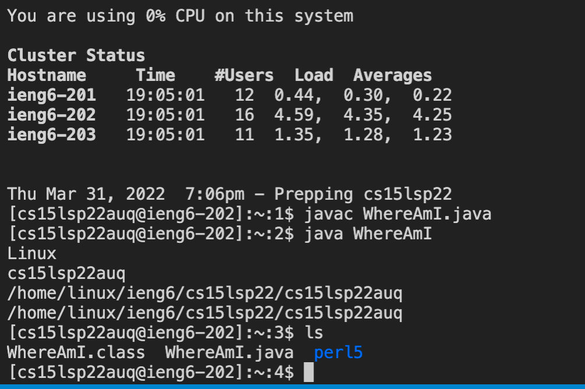
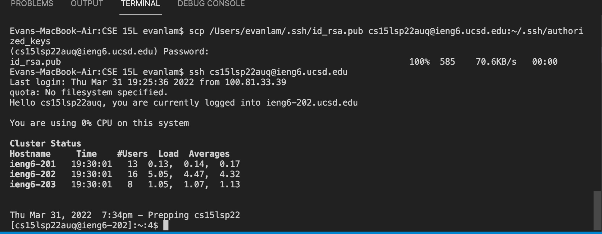

# Log Onto Course Specific Account ieng6
## Installing Visual Studio Code

* Go to the visual studio code website and click Download button on the page
* Once Downloaded drag the Visual Studio Code Icon into Applications folder
* Visual Studio Code is now installed on computer and is useable

## Remotely Connecting

* Open a new terminal and at the commandline type the command: $ssh cs15lsp22auq@ieng6.ucsd.edu (note: auq is my course-specific account, it should be replaced with the users course-specific account)

* If logging in for the first time, the computer will ask for your key fingerprint. Enter "yes" to the following messages

* Computer will prompt you for your password. Enter in your password (you wont see it being typed out on the screen) and you will successfully connect (note: during lab my password wasn't working so I logged in with Ta account, but my password worked later)

## Trying some commands

* Now that we are connected to the remote computer, we can run some commands such as cd, ls -a, etc, by typing the commands in the command line and we can see the results

* For /home/linux/ieng6/cs15lsp22/cs15lsp22aus command as illustrated above, this works becuase I am logged into the TA account which has access to the aus user who is a student in the class

## Moving Files With SCP

* SCP moves a file from the local computer to the remote computer

* Run the command scp (insert file name) cs15lsp22zz@ieng6.ucsd.edu:~/, and enter your password. The file will be moved over.

* If we connect to remote computer using ssh, we can run the command ls and see the file in the directory, indicating the file moved successfully. We can work with this file on the remote computer now. 

## Setting an SSH Key

* Run the command ssh-keygen which generates a public/private rsa keypair. You will then be prompted to enter a file to save the key which you will put (/Users/(enter your username on your personal computer)/.ssh/id_rsa): /Users/(enter username on personal computer)/.ssh/id_rsa. You will then be prompted to enter a passphrase which you should skip and just press enter. A encrypted image will then be printed indicating that the private and public keys have been created.

* Log onto the remote computer using ssh cs15lsp22auq@ieng6.ucsd.edu (you will still need to enter password at this stage of the process), and once you log in make a new directory .ssh using the command mkdir .shh. Then log out.

* scp the public key id_rsa.pub to the .ssh directory that was just created. Use the command scp /Users/(enter Username on computer)/.ssh/id_rsa.pubcs15lsp22auq@ieng6.ucsd:~/.ssh/authorized_keys. Now that the public key is saved in the remote directory, when we try to ssh again to connect to the remote computer, it will not longer ask for our password. 

