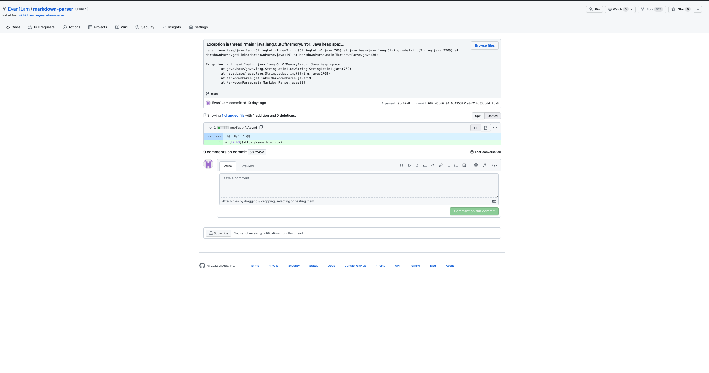

# Coding changes to fix bugs in Markdown Parse code
## Coding change 1

*first test file with failure inducing input: extra parenthesis at the end of link*

* [firstTestFile](newTest-file.md)
*symptom of failure-inducing input*

* the failing inducing input was an extra parenthesis at the end of the link, which caused the markdown parse code to look for another link when there wasn't one present. To fix this bug, I added an if statement that checks for the presence of an open bracket "[", such that if there is no open bracket then the code will end as the open bracket indicates the start of a new link.

