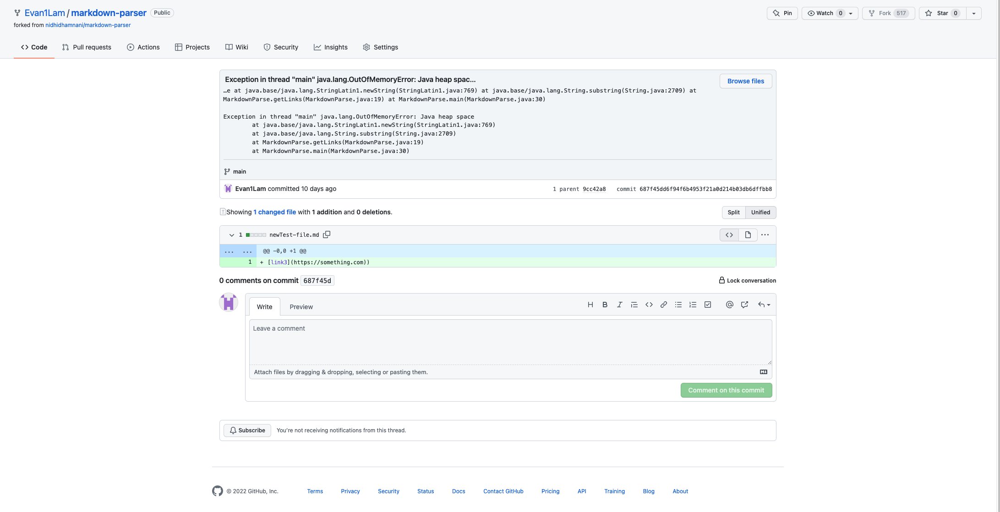
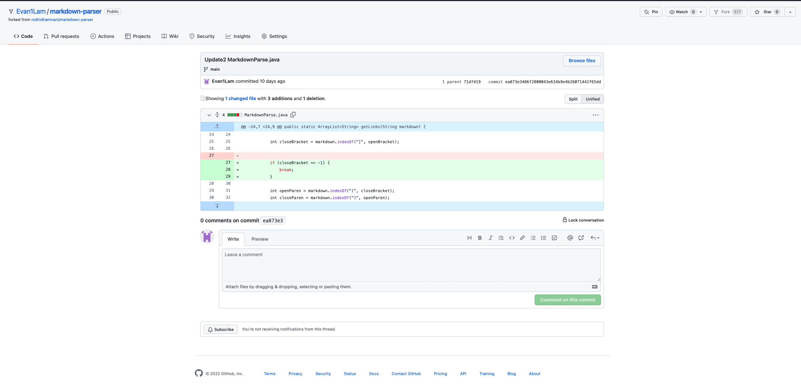
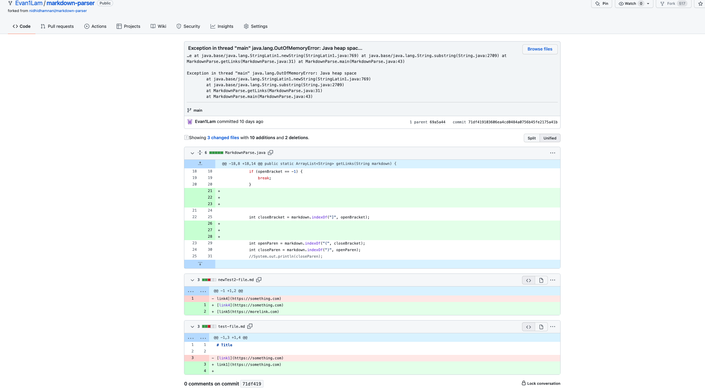

# Coding changes to fix bugs in Markdown Parse code
## Coding change 1

*first test file with failure inducing input: extra parenthesis at the end of link*

* [firstTestFile](newTest-file.md)
*symptom of failure-inducing input*

* the failing inducing input was an extra parenthesis at the end of the link, which caused the markdown parse code to look for another link when there wasn't one present. To fix this bug, I added an if statement that checks for the absence of an open bracket `[`, such that if there is no open bracket then the while loop will break as the open bracket indicates the start of a new link.

## Coding change 2

*second test file with failure inducing input: no closed braket at the end of link name*

* [secondTestFile](https://github.com/Evan1Lam/markdown-parser/blob/main/newTest2-file.md)

*symptom of failure-inducing input*

* the failing inducing input was a missing closed bracket at the end of the link name, which causes the markdown parse code to continue parsing throght looking for the end of the link name which it is never going to find, resulting in an out of memory error. To fix this bug, I added an if statement that checks for the absence of a closed bracket `]`, such that if there is no closed bracket found at the end of the link name then the while loop will end. 
