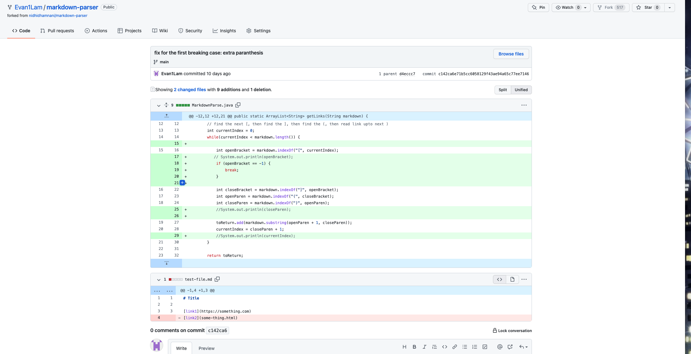

# Coding Changes to fix bugs in Markdown Parse Code
## Coding change 1

*first test file with failure inducing input: extra parenthesis at the end of link*
* [firstTestFile](https://github.com/Evan1Lam/markdown-parser/blob/main/newTest-file.md)

*symptom of failure-inducing input*

* the failing inducing input was an extra parenthesis at the end of the link, which caused the markdown parse code to look for another link when there wasn't one present, resulting in an out of memory error as the while looop will keep running. To fix this bug, I added an if statement that checks for the absence of an open bracket `[`, such that if there is no open bracket then the while loop will break as the open bracket indicates the start of a new link.

## Coding change 2

*second test file with failure inducing input: no closed braket at the end of link name*
* [secondTestFile](https://github.com/Evan1Lam/markdown-parser/blob/main/newTest2-file.md)

*symptom of failure-inducing input*

* the failing inducing input was a missing closed bracket at the end of the link name, which causes the markdown parse code to continue parsing through looking for the end of the link name which it is never going to find, resulting in an out of memory error as the while loop will keep running. To fix this bug, I added an if statement that checks for the absence of a closed bracket `]`, such that if there is no closed bracket found at the end of the link name then the while loop will end. 

##Coding change 3

*third test file with failure inducing input: missing open paranthesis*
* [thirdTestFile](https://github.com/Evan1Lam/markdown-parser/blob/main/newTest3-file.md)

*symptom of failure-inducing input*

* the failing inducing input was a missing open parenthesis at the beginning of the link body, which causes the markdown parse code to continue parsing through looking for the start of the link body which it is never going to find, resulting in an out of memory error as the while loop will keep running. To fix this bug, I added an if statement that checks for the absence of an open parenthesis `(`, such that if there is no open parenthesis found at the beginning of the link body then the while loop will end. I also added an if condition to check for the closed parenthesis `)`, for the same reason. 

