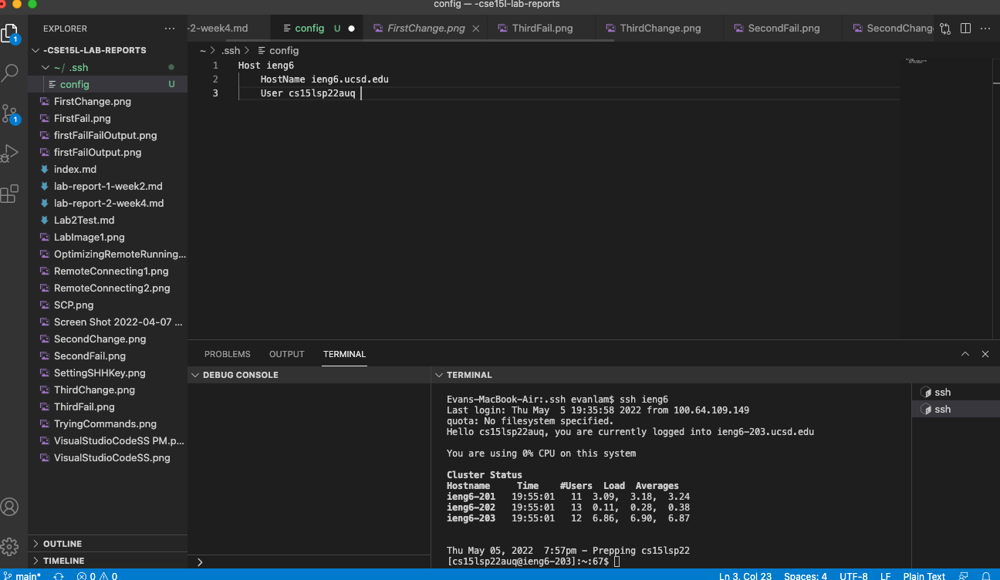
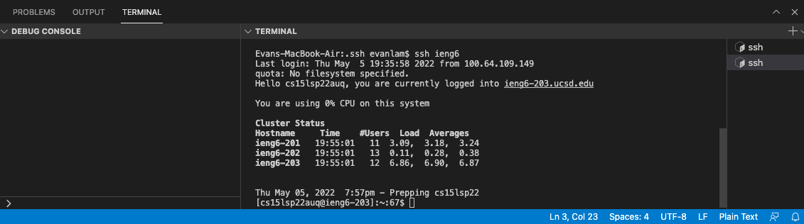
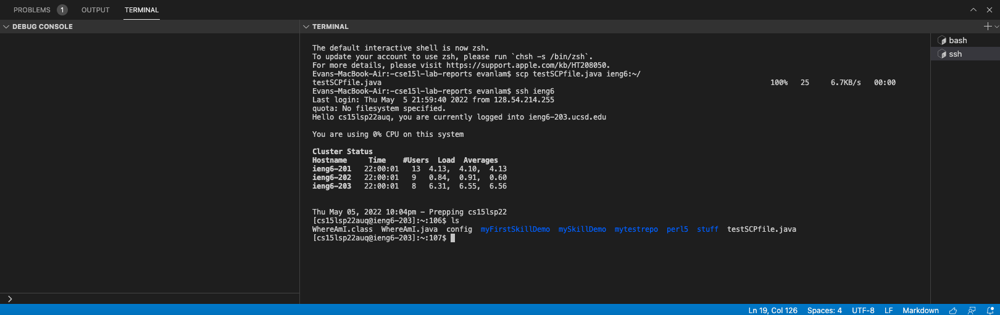
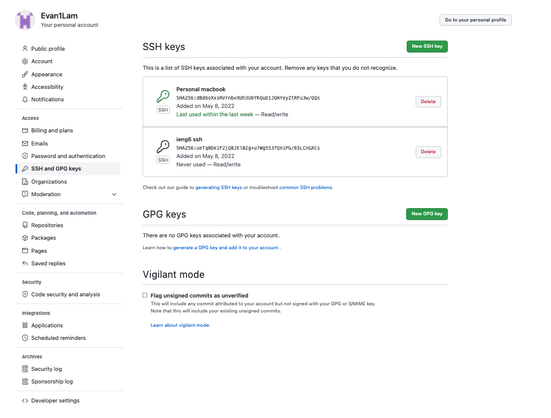
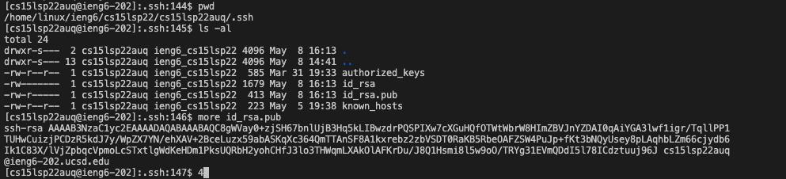
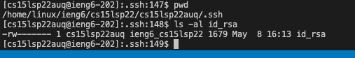
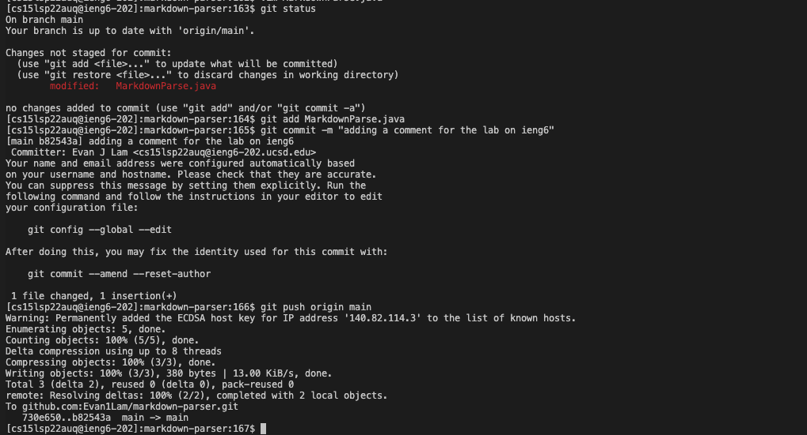
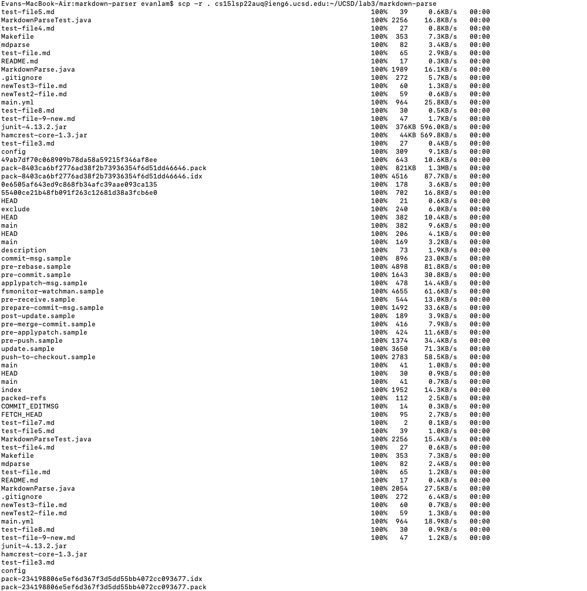
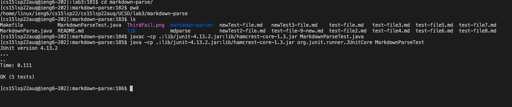
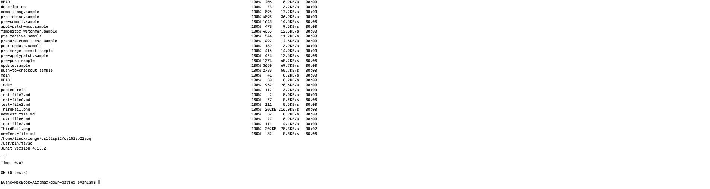

# Lab report 3
## streamlining ssh Configuration

* create a file called config in VScode, with the following lines of code to set up a new hostname `ieng6` for remote computer account. 

* we can now `ssh` by just typing `ssh ieng6` instead of having to type out the entire username `cs15lsp22auq@ieng.ucsd.edu`.

* we can also `scp` with this abreviated new hostname, by just typing `scp <file name> ieng6:~/`. As seen in the image this successfully copies a file into our remote computer.

## Setup Github Access from ieng6

**public key stored on Github**

* enter `pbcopy < ~/.ssh/id_rsa.pub` in terminal to copy the public key, go to user settings on GitHub, click on SSH and GPG keys in the side bar, click on New SSH key, name your key, and then paste the public key into box and save it. This allows us to use git commands to commit and push to main in the terminal without having to enter username or password. 

**public key stored in user account**

* to view this, `ssh` into remote computer, enter `cd .ssh`, then enter `ls -al`, and the ssh keys will display. `id-rsa.pub` is the public key, and we can enter `more id_rsa.pub` to view the key itself 

**private key stored in user account**

* follow the steps to view public key and the private key is `id-rsa`. Or, instead of entering `ls -al`, enter `ls -al id_rsa` to view the key on its own.

**running git commands to commit and push a change to Github while logged into ieng6**

* using the public key created for ieng6, we can commit changes to files from the command line. `git status` informs us if a change has been made, then to commit and push a file, enter in the following commands: `git add <file name>`, then `git commit -m "<insert whatever commit message>"`,then `git push origin main`. Because the public key has been stored on gitHub there will be no prompt for username or password.

**link for resulting commit**

* we can view the commit on gitHub by clicking on commits. Here is the link to a commit made on `MarkdownParse.java`, where a comment was added.

[MardownParse.java commit Link](https://github.com/Evan1Lam/markdown-parser/commit/b82543af9e48dddc7c064757126b928151bca015)

## Copy whole directories with scp -r

* enter  `scp-r . cs15lsp22auq@ieng6.ucsd.edy:~/markdown-parse` to copy the whole `mardown-parser` directory into ieng6 account. I entered `scp-r . cs15lsp22auq@ieng6.ucsd.edy:~/UCSD/lab3/markdown-parse` to copy this in a new folder, to avoid overriding the exisitng markdown parse. 

* now that the entire directory is in `ssh` account, we can run commands in command line such as tests for files in the directory. This image demonstrates running tests in the command line for `MarkdownParseTest.java`

* we can also run multiple commands in a single line, by seperating the commands with `;` and surrounding commands in `""` to immediately run them. 

* the following images are an example of `scp` and `ssh` commands in a single line to copy a directory and run tests on it. 

* Note: there are two java compilers installed on ieng6. When you `ssh` running the java command it goes to the previous compiler, but the code in `MarkdownParse.java` and `MarkdownParseTest.java` need to be compiled and run on the java-17 compiler, so you have to specify the whole absolute path to the java-17 compiler to compile the code, and specify the absolute path to the java-17 runtime to run the code. Similarly, specify the absolute path to the two jar files: `hamcrest.jar` and `Junit.jar`, in both the compiling and running of the program.

