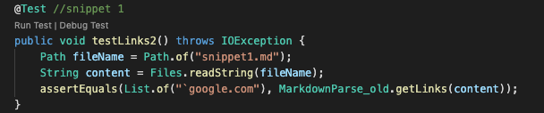
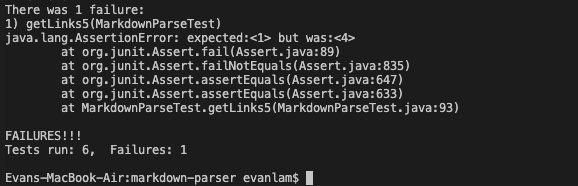
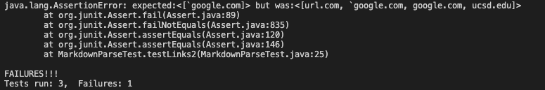
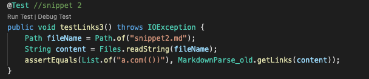
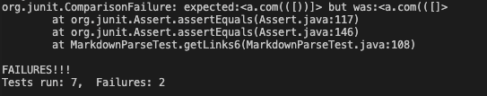
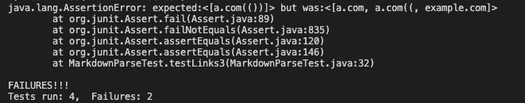
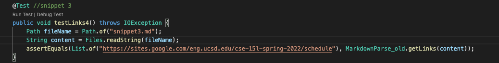
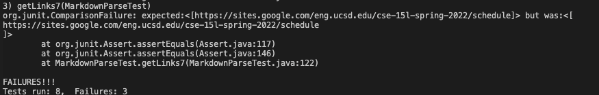
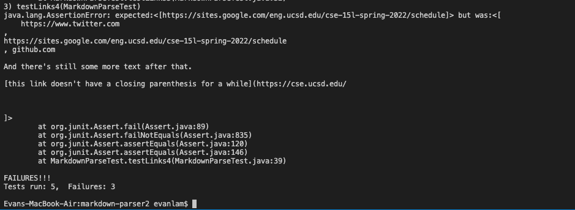

# lab report 4
## markdown-parse repository
 
 [my repository](https://github.com/Evan1Lam/markdown-parser.git)

 [reviewed repository](https://github.com/zayverrulez/markdown-parser.git)

 ## snippet 1

 **Expected Results:**

* the only valid link is `[another link](`google.com)``.
 So, we expect only this link to be outputted and the other links should be disregarded. The output would be ``google.com`

*Test for snippet 1*

* My implementation: fail

* reviewed implementation: fail

* The problem for both of our implementations is both of our markdown Parse codes are reading in invalid links, not properly catching them. A code change would perhaps be to have a condition that checks for backticks anywhere before the open parenthesis, because it is fine to have backticks in the actual link but if they are in the link name it will throw the code off. So, the condition is to check for that and if it encounters such a case then continue.

## snippet 2

 **Expected Results:**
`
* the only valid link is `[a nested parenthesized url](a.com(()))` So, we expect only this link to be outputted and the other links should be disregarded. the output should be `a.com(())`

*Test for snippet 2*

* My implementation: fail

* reviewed implementation: fail

* The problems for both of our implementations is both of our markdown Parse codes are reading in invalid links, not properly catching them. In addition, it is also not properly outputting the expected link `a.com(())`, as it instead outputs `a.com((`. I am not sure how to implement a code change for this, but perhaps we could add an extra condition in the condition where we check for open and closed paranthesis, such that there would be an additional `if` statement that checks for nested paranthesis?

## snippet 3

 **Expected Results:**
`
* the only valid link is `[this title text is really long and takes up more than 
one line](
https://sites.google.com/eng.ucsd.edu/cse-15l-spring-2022/schedule
)`  So, we expect only this link to be outputted and the other links should be disregarded. the output should be 
`https://sites.google.com/eng.ucsd.edu/cse-15l-spring-2022/schedule`

*Test for snippet 3*

* My implementation: fail

* reviewed implementation: fail

* The problems for both of our implementations is both of our markdown Parse codes are reading in invalid links, not properly catching them. In addition, it seems like for the valid link it is not properly outputting the link, as it adds an extra line at the end. I am also not entierly sure how to fix this, but perhaps we could add an `if`condition to check for new lines located where we check for our brackets and parenthesis, and if there is a new line detected then delete the new line and continue?

