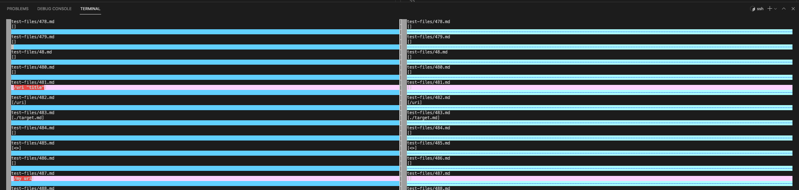
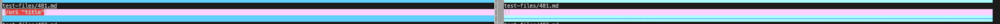
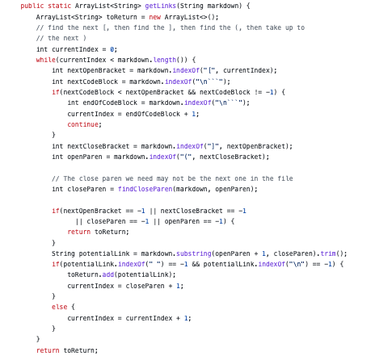
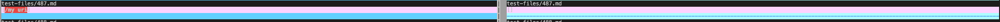
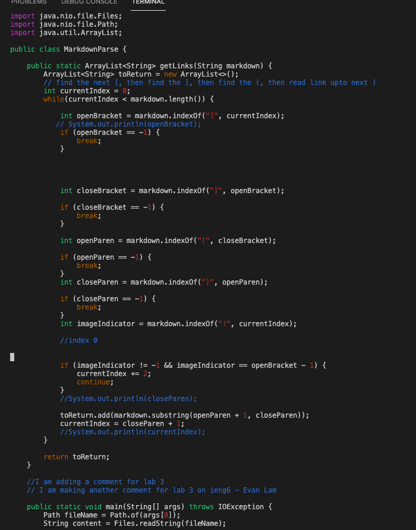

# lab report 5

* I ran `vimdiff my-markdown-parser/results.txt cse15lsp22-markdown-parser/results.txt` to see the different outputs. By doing so, we can see my implementation outputs and the other repository implementation outputs for each test file side by side, and see how they differ as indicated by the image. We can compare these differences to the actual expected output

*test-file 481 difference*
[test-file 481 link](https://github.com/nidhidhamnani/markdown-parser/blob/main/test-files/481.html.test)

* my implementation is correct as my implementation gives a link with `/uri "title"` as it should because this is a valid link, and the provided implementation is incorrect as it gives no link, just an empty `[]`, 

*actual outputs from both implementations*

* expected output for test-file 481: `link`, so because it shows up as a link in MarkDown it is a valid link, and hence we expect to see the name of the link outputted from our MarkDownParser. (used commonMark to check)

* Provided MarkDownParse implementation

* the bug in this code is in the getlinks method. The getlinks method does not have a way to recognize `<>` characters and the following notation `
`. We need to add a conditon that checks for these in order to parse through them. 

*test-file 487 difference*
[test-file 487 link](https://github.com/nidhidhamnani/markdown-parser/blob/main/test-files/487.html.test)

* my implentation is incorrect as my implemntation gives a link as `/my uri` while the provided implemtntation is correct as it gives no link, just an empty `[]`, as it should because this link is not a valid link.

*actual outputs from both implementations *

* expected output for test-file 487 `[link](/my uri)`, so because it does not show up as a link in MarkDown it is not a valid link, and hence we expect to see just `[]` outputted from MarkDownParse (used commonMark to check)

* my MarkDownParse implementation

* the bug for my implentation is also a general absence in my getlinks method. I do not have any way to check for `<>` characters and the notation given by the test link, so my code can't determine what is a valid link and invalid link with `<>` characters. To fix this, I would need to add conditons that check for these characters in order to distinguish to parse through them or not. 